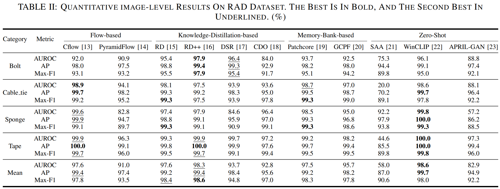

# RAD: A Comprehensive Dataset for Benchmarking the Robustness of Image Anomaly Detection

Yuqi Cheng, Yunkang Cao, Rui Chen, Weiming Shen*

(*Corresponding authors)

Our paper has been accepted by CASE 2024 [[Paper]](https://arxiv.org/abs/2406.07176)

# Overview
This study introduces a Robust Anomaly Detection (RAD) dataset with **free views, uneven illuminations, and blurry collections** to systematically evaluate the **robustness** of current anomaly detection methods.


# RAD


Following the mainstream unsupervised anomaly detection setting (MVTec), we collected a total of 286 normal samples, of which 213 are used for training, and the remaining 73 for testing. Additionally, 327, 293, 281, and 323 abnormal samples across the four categories are used for testing, respectively.


## Download

+ To download the RAD-AD dataset,  click [RAD-dataset.zip(baidu disk: k4a7)](https://pan.baidu.com/s/19VKrQpLQq-D6TGaN95q8Tw?pwd=k4a7), or [RAD-dataset(google drive)](https://drive.google.com/drive/folders/14sTEtptHbhECPbd7WyhpvtR9BA4YdjCP).


### Data Struct

```
RAD-dataset
├── bolt
    ├── train
        ├── good
    ├── test
        ├── good
        ├── defect
    ├── ground_truth
        ├── defect
├── ribbon
...
```

  

## Data Collection

Normal scenarios depict a work platform with multiple metal holes, whereas the abnormal scenarios feature the work platform with foreign objects. To establish a comprehensive benchmark for anomaly detection robustness, we introduce different types of foreign objects onto the work platform, including bolts, cable ties, sponges, and tapes. Subsequently, the images are captured under various imaging noises, encompassing random viewpoints, illuminations, and imaging distances to replicate practical noise scenarios. 


## Annotation

Each abnormal sample has been accurately labeled.


## Benchmark

### Comparison Methods
  
Representative methods, including both unsupervised anomaly detection (CFlow, PyramidFlow, RD, RD++, DSR, CDO, PatchCore, GCPF) and zero-shot anomaly detection (WinCLIP, APRIL-GAN, SAA) methods, are selected for evaluation.

+ CFlow: https://github.com/gudovskiy/cflow-ad
+ PyramidFlow: https://github.com/gasharper/PyramidFlow
+ RD: https://github.com/hq-deng/RD4AD/tree/main
+ RD++: https://github.com/tientrandinh/Revisiting-Reverse-Distillation
+ DSR: https://github.com/VitjanZ/DSR_anomaly_detection
+ CDO: https://github.com/caoyunkang/CDO
+ PatchCore: https://github.com/amazon-science/patchcore-inspection
+ GCPF: https://github.com/smiler96/GCPF
+ WinCLIP: https://github.com/caoyunkang/WinClip
+ APRIL-GAN: https://github.com/ByChelsea/VAND-APRIL-GAN
+ SAA: https://github.com/caoyunkang/Segment-Any-Anomaly

### Metrics
  
We choose AUROC, Max-F1 and AP as metric for image-wise anomaly detection. We choose AUROC, Max-F1, AP and AUPRO as metric for pixel-wise anomaly detection.

### Benchmark results





## Acknowledgments.
Resrach supported by the Fundamental Research Funds for the Central Universities: HUST:2021GCRC058.


## License
The dataset is released under the CC BY 4.0 license.

## BibTex Citation

If you find this paper and repository useful, please cite our paper☺️.

```
@inproceedings{Cheng2024RAD,
  title={RAD: A Comprehensive Dataset for Benchmarking the Robustness of Image Anomaly Detection},
  author={Yuqi Cheng, Yunkang Cao, Rui Chen and Weiming Shen},
  booktitle={2024 IEEE 20th International Conference on Automation Science and Engineering},
  year={2024}
}
```
